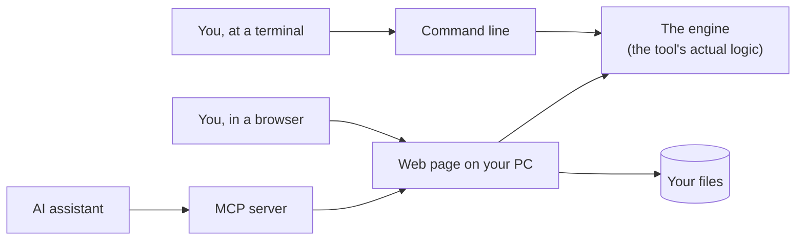
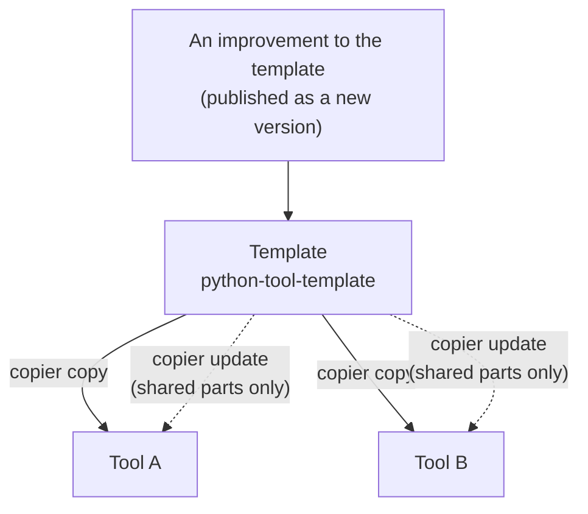

# The tool template, for the curious

*What this repository is for, what problems it solves, and the handful of ideas
that make it work, explained without assuming you build software for a living.*

If you have ever thought "someone should make a little tool for that", this page
is for you.

---

## The one-minute version

This repository is a **tool kit in a box**. You answer a few questions (what the
tool is called, what it does), and a minute later you have a small, working
application that:

- **opens in your browser**, runs on your own PC, and can be stopped, restarted
  and updated with a button;
- **can be driven by an AI assistant** (such as Claude Code), which works on the
  same files you see on screen;
- **tells you when a newer version exists**, and updates itself if you want it to.

Everything you don't want to think about is already done: starting and stopping,
the About box, updates, releases, Windows support, tests. What's left is the
interesting part: the idea itself.

---

## The problems we kept running into

We built two tools the same way: [metro-map-tool](https://github.com/ERP-LAB-5/metro-map-tool)
draws transit-map style diagrams, and [sap-di-tools](https://github.com/ERP-LAB-5/sap-di-tools)
compares SAP Data Intelligence replication flows. Along the way the same
problems came back each time.

| The pain | What the template does about it |
|---|---|
| **Every tool rebuilt the same plumbing**: start, stop, About box, updates. The copies slowly drifted apart. metro-map's About could update itself; di's only showed a number. | The plumbing lives in one place, the template, and every tool gets the same, best version. Fixes flow to all tools. |
| **"Works on my machine."** On our workstation, ROS 2 (robotics software) sets a Python setting that quietly broke other Python tools and their tests. One tool had Windows launchers, the other didn't. | Every tool starts through the same launcher, which shields it from that setting, with matching launchers for Windows. |
| **Nobody knows they are on an old version**, let alone how to update. | The About box compares your version with the latest release and offers *Update and restart*. |
| **Releases fell behind.** metro-map had tags up to v3.1.2, but its GitHub releases stopped at v2.17.0. Nobody forgot on purpose; there were just too many small steps. | One release command does every step, in order, every time. |
| **AI assistants had to be taught each tool from scratch**, and the instructions we gave them went stale after updates. | Each tool ships its own instructions for the assistant (a *skill*), installed and updated like an app. |
| **Sensitive data must never reach a public repository.** A replication-flow export contains system IDs and table lists. | Data folders are kept out of git by default, the template never overwrites a tool's own ignore rules, and sap-di-tools additionally runs a test that fails if anything shaped like a system ID is about to be published. |

---

## Experimentation is a feature, not an accident

Here is the honest truth: **most ideas for tools should be tried, not planned.**

The expensive part of a small tool was never the idea. It was the two days of
plumbing before you could show anyone anything. The template removes those two
days. That changes what's worth trying:

- **From idea to clickable prototype in minutes.** Generate a tool, change the
  sample into your idea, open it in the browser, show a colleague.
- **Cheap to throw away.** It is one folder on your PC. Delete it and it's gone:
  no server, no cloud account, nothing to cancel.
- **Cheap to keep.** If the experiment works, it already *is* a real tool, with
  tests, releases and updates. There's no "now rewrite it properly" phase.
- **Safe to play with.** The tool runs only on your own computer (see
  *local-only* below), so an experiment can't break anything shared.

The loop we recommend:

> **ask** (tell the AI assistant what you want) → **generate** (the template
> builds the skeleton) → **try** (click around, poke at it) → **keep or bin**.

If you bin nine ideas and keep one good tool, that's a great result. Curiosity
is the whole point. :-)

---

## Key concepts, explained

### 1. Three doors into one room

Every tool has three ways in, and they all lead to the same place:



- The **engine** is where the real work happens: comparing flows, drawing a map.
- The **command line** is for scripts and people who like typing.
- The **web page** is for everyone else.
- The **MCP server** lets an AI assistant use the tool (more below).

*Analogy:* a shop with a front door, a side door and a delivery hatch. There are
three entrances but one shop and one set of shelves. What the assistant puts on
a shelf, you see on the same shelf.

### 2. Template vs. tool: the cookie cutter that can reshape cookies

The template is a **cookie cutter**. Running `copier copy` cuts a new tool. The
unusual part is that **Copier** (the program that does this) can also reshape
cookies you already baked: `copier update` brings later improvements from the
template into an existing tool.



This only works because every file has a clear owner:

- **Core-owned** files are the shared plumbing: starting, stopping, the About
  box, the page header. The template owns them and updates them.
- **Tool-owned** files are what makes your tool yours: its logic, its page, its
  README. The template creates them once and never touches them again.

*Analogy:* the **wiring** of a house versus your **furniture**. The electrician
may upgrade the wiring, but never rearranges your living room.

### 3. Local-only: it runs on your PC, and only obeys your PC

When you start a tool, it opens a small web server on **your own computer**. The
address looks like `http://127.0.0.1:8766`, where `127.0.0.1` means "this very
machine". Nothing is hosted anywhere.

The buttons that change the tool itself (**Stop**, **Restart**, **Update**)
only accept requests that come from your own PC. A web page in another browser
tab, or another computer on the network, can't press them.

*Analogy:* a light switch inside your flat, not on the street.

### 4. A separate toolbox per tool (the "virtual environment")

Python tools depend on other pieces of software, often in specific versions. If
all tools shared one pile of pieces, updating one tool could break another.
Ubuntu, the Linux system we use, actually refuses to let you mix them.

So each tool gets its own **virtual environment**, a private toolbox in a folder
called `.venv`. You never have to create it: the launcher (`run.sh`, or
`run.cmd` / `run.ps1` on Windows) builds it the first time, and refreshes it
when the tool's list of requirements changes.

### 5. One version number, everywhere

Each tool has one file called `VERSION`, containing something like `0.2.0`. Every
place that shows or needs a version reads that one file. So they can't disagree.

That's also how the **About box** knows about updates: it fetches the `VERSION`
file of the latest release from GitHub and compares it with yours. It's a single
request for a tiny text file, remembered for six hours, and it sends nothing
about you or your data. If there's no network it simply says so. Start the tool
with `--no-update-check` and it never asks at all.

### 6. MCP: a standard socket for AI assistants

**MCP** (Model Context Protocol) is a standard way for an AI assistant to use a
program: to see which actions it offers and press those buttons.

*Analogy:* a **universal power socket**. Any assistant that has the plug can use
any tool that has the socket.

Two details make it pleasant to work with:

- **The assistant and you share the same files.** You can watch its work appear
  in the browser, or take over by hand.
- **Nobody silently overwrites anybody.** In tools that keep documents, if the
  assistant saved one while you were still editing it, your save is refused with
  a clear choice: *load theirs* or *keep mine*.

### 7. Skills: the instruction manual travels with the tool

A **skill** is a document that teaches the assistant how to use a tool well:
what the concepts mean, which commands exist, what to be careful about.

The trick: the skill **ships inside the tool**. When the tool is updated, its
instructions are updated with it. An automatic test even checks that every
command the skill mentions really exists.

### 8. Plugins and the marketplace: an app store for the assistant

A **plugin** bundles a tool's skill (and, if it has one, its MCP server) so
Claude Code can install it in one step. A **marketplace** is a list of plugins
to choose from. This repository is the `erp-lab-5` marketplace.

There are two kinds of plugins in it:

| Plugin | For | What it gives the assistant |
|---|---|---|
| `pytool-kit` | **building** tools | knowledge of the template, plus `new-tool`, `update-core` and `release` |
| one per tool, e.g. `di-replication-sync` | **using** a tool | that tool's skill (and its MCP server, if it has one) |

### 9. Options: take only what you need

When you create a tool, you pick from a short menu:

| Option | Choose it when… |
|---|---|
| **MCP server** | an AI assistant should *act* through the tool, not just read about it |
| **Windows launchers** | colleagues on Windows will run it (on by default) |
| **Workspace folders** | the tool keeps documents: yours in a private folder, examples shipped with the tool |
| **Release script** | you'll publish versions others install (on by default) |
| **Plugin** | people should install it into Claude Code in one step (on by default) |

### 10. Releasing in one step

A release used to be a checklist people half-remembered. Now one command does
all of it, in this order:

1. refuse unless all work is saved (committed) and the tests pass;
2. write the new version number everywhere it appears;
3. update the install instructions in the README to the new version;
4. make sure the assistant's instructions (the skill copies) are in step;
5. record the release in git and tag it;
6. publish it on GitHub, so every About box can see it.

A **dry run** shows what it would do without doing anything.

### 11. Tests that test the template by *using* it

A mistake in the template would spread to every tool, so the template is tested
the way you would use it. For each set of options it:

- creates a sample tool;
- runs the sample's own tests;
- installs it;
- starts it, restarts it and stops it;
- lets an AI-style client save and read a document through it;
- checks that a `copier update` changes only the shared parts.

This runs automatically on GitHub for every change, on Linux, plus a Windows run
that creates a sample, runs its tests and starts it with the Windows launcher.
It already paid off: the very first Windows run caught a launcher bug nobody had
noticed.

---

## Who does what

| | You | The AI assistant (with `pytool-kit`) | The template |
|---|---|---|---|
| Have the idea | ✔ | | |
| Create the tool | say what you want | runs `new-tool`, checks the port is free, proves it starts | provides the skeleton |
| Build the actual logic | try it, give feedback | writes engine, page, MCP actions, skill and tests together | keeps the plumbing out of the way |
| Keep it healthy | | runs `update-core` when the template improves | ships fixes to all tools |
| Publish a version | approve | runs `release` (asks before publishing) | provides the release script |

---

## Try it (about 10 minutes)

You need Python 3.10 or newer and git. On Windows, use `run.cmd` wherever
`./run.sh` appears.

### Path 1: use an existing tool

```bash
git clone https://github.com/ERP-LAB-5/sap-di-tools
cd sap-di-tools
./run.sh                 # then open http://127.0.0.1:8766 and click About
```

(Until [pull request #1](https://github.com/ERP-LAB-5/sap-di-tools/pull/1) is
merged, run `git switch adopt-template` before `./run.sh` to see the new About
box.)

### Path 2: start an experiment

**With the AI assistant**, in Claude Code:

```
/plugin marketplace add ERP-LAB-5/python-tool-template
/plugin install pytool-kit@erp-lab-5
```

Then just describe your idea, e.g. *"make me a new tool that keeps a checklist
for system copies"*, or run `/pytool-kit:new-tool`.

**By hand:**

```bash
pipx install copier      # once (Ubuntu: sudo apt install pipx && pipx ensurepath, new terminal)
copier copy gh:ERP-LAB-5/python-tool-template my-idea
cd my-idea
./test.sh                # the sample works as generated
./run.sh                 # open the address it prints
```

You now have a working "notes" sample. Change it into your idea (or ask the
assistant to).

### Path 3: bin it or keep it

**Bin it:**

```bash
./run.sh --stop
cd .. && rm -rf my-idea
```

**Keep it:** put it in git and on GitHub, and let the assistant handle releases
from there:

```bash
git init -b main && git add -A && git commit -m "Start my-idea"
gh repo create ERP-LAB-5/my-idea --private --source . --push
```

---

## Mini glossary

| Term | In one line |
|---|---|
| **CLI** | Command-line interface: using a program by typing commands. |
| **Engine** | The part of a tool that does the actual work; the page and the CLI only call it. |
| **Flask** | The small Python library that serves each tool's web page. |
| **Loopback / 127.0.0.1** | The address that means "this computer"; used so tools are only reachable locally. |
| **Virtual environment (venv)** | A private folder of software pieces for one tool, so tools don't interfere. |
| **PEP 668** | The Python rule by which Ubuntu refuses to mix tool dependencies into the system. |
| **MCP** | Model Context Protocol: the standard socket that lets an AI assistant use a tool. |
| **Skill** | A document that teaches an AI assistant how to use a tool well. |
| **Plugin** | A bundle (skill, optionally an MCP server) that installs into Claude Code in one step. |
| **Marketplace** | A list of plugins to install from; `erp-lab-5` is ours. |
| **Copier** | The program that creates tools from the template and updates them later. |
| **Core-owned** | Shared plumbing files that the template maintains in every tool. |
| **Tool-owned** | Files that belong to one tool alone and are never overwritten. |
| **Tag / release** | A named, published version of a tool, e.g. `v0.2.0`. |
| **CI** | Continuous integration: tests that run automatically on GitHub for every change. |

---

## Questions people ask

**Is it safe? Does it send my data anywhere?**
The tool runs on your PC. The only thing it contacts on its own is GitHub, to
read one small version file for the update check, and you can switch that off
with `--no-update-check`. What the tool itself does with your data is up to that
tool, and is described in its README.

**Can these tools connect to SAP systems?**
Not by themselves. The template doesn't connect to anything. Each tool decides.
sap-di-tools, for instance, deliberately never connects to a system: every
result is a file you check and upload yourself.

**Do I need to know how to program?**
To *use* a tool, no. To *experiment*, not much: with the AI assistant, you
describe what you want and review what you get. Knowing some Python helps when
you want to go further.

**Does it work on Windows?**
Yes. Each tool can come with `run.cmd` and `run.ps1`, and the template is tested
on Windows automatically.

**What happens when the template changes?**
Nothing, until a tool takes the change with `copier update`. The update only
touches the shared plumbing, shows exactly what changed, and runs the tests.

**Can I really just delete an experiment?**
Yes. Stop it, delete the folder. If you never pushed it to GitHub, it never
existed anywhere else.

**Who maintains this?**
[D-LAB-5](https://github.com/ERP-LAB-5). Improvements to the template are
welcome. They reach every tool, which is the whole point.

---

*Twin. Experiment. Automate.*
